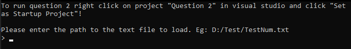
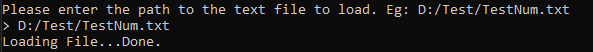
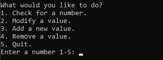
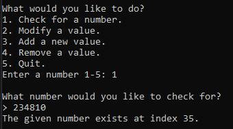
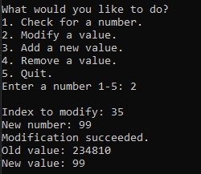
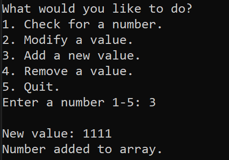
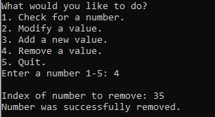
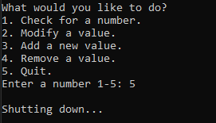

# Assignment 1

### Running the code.
To build and run the code you will need Visual Studio 2022 with the Desktop development with C++ workload installed. Once installed you can open the solution file (Assignment 1.sln) and use the F5 key to run the selected question/project.

**NOTE:** To select which question/project to run, right click on the project in the Solution Explorer and select "Set as Startup Project".

## Overview
Questions 1 and 2 are the same in function but Question 2 makes use of some try-catch blocks around the user inputs for functions two and three. The changes in question 2 can be found by searching for "Modified for Question 2" in the main.cpp for that project.

## Usage examples of functions

### Startup
Upon running the program you will first be asked to enter the path to the txt file to load.  

Upon entering the full path to a text file it will then load the file and read the integers from the file.  

The program then asks which function you would like to run, which you can select by entering a number 1 through 5 followed by the enter key.  

#### 1. Check for a number.
This function will check if a certain integer exists in the array if the number is present return the index of the first occupance of the number if it is present in the array.  

#### 2. Modify a value.
This function will try to modify the value of an integer at a specific index, and it will return display the new and old value back to the user.    

#### 3. Add a new value.
This function will add the given integer to the end of the array.  

#### 4. Remove a value.
This function takes removes the value at the given index of the array.   

#### 5. Quit.
This function causes the program to exit.   

