# Assignment 2 - Question 1

### Running the code.
To build and run the code you will need Visual Studio 2022 with the Desktop development with C++ workload installed. Once installed you can open the solution file for the question (Question1.sln) and use the F5 key to run the opened question/project.

## Overview
This program is a simple driver program for the functions of a custom single linked list template class.

## Usage examples of functions

### Startup
Upon starting the program you will be asked if you would like to prefill the list with debug data.   
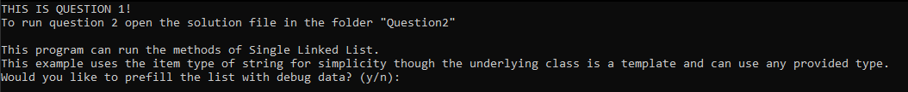   
Entering 'y' will prefill the list with debug data.   
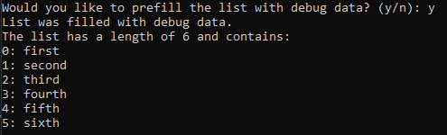   
Entering 'n' (or any other input) will cause the program start with an empty list.   
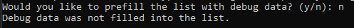   
(*The following examples assume that the list was prefilled with debug data.*)

### Command list
Before running a command all the commands are listed, and the user is asked to enter the number of the command they wish to run.   
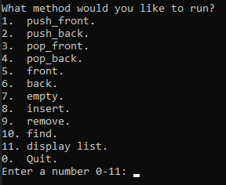   
(*For the sake of brevity the command list will be omitted from the following screenshots.*)

### 1.  push_front
This command pushes the given item onto the front of the list.   
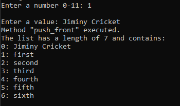

### 2.  push_back
This command pushes the given item onto the back of the list.    
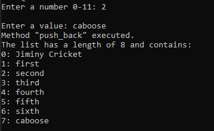

### 3.  pop_front
This command removes the first item in the list.    
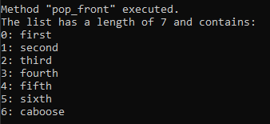

### 4.  pop_back
This command removes the last item in the list.    
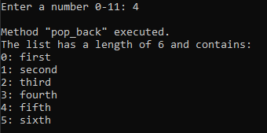

### 5.  front
This command gets the first item in the list.   
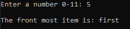

### 6.  back
This command gets the last item in the list.   
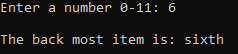

### 7.  empty
This command checks if the list is empty.   
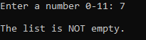  
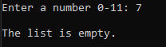

### 8.  insert
This command inserts an item at the given index in the list. If the index is greater than the length of the array it will instead insert the item at the end of the list.   
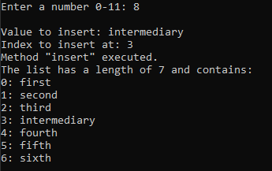

### 9.  remove
This command attempts to remove the item at the given index.  
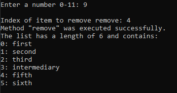
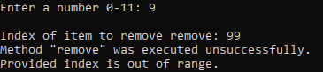

### 10. find
This command attempts to find the given value in the array and return its index or the length of the array if it fails.  
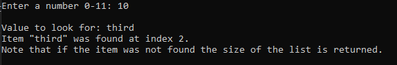
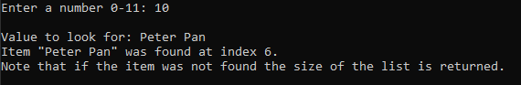

### 11. display list
This extra command will display the contents of the list and the number of items.   
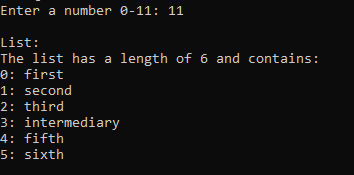

### 0.  Quit
This command causes the program to exit.   
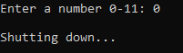

