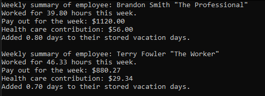

# Assignment 2 - Question 2

### Running the code.
To build and run the code you will need Visual Studio 2022 with the Desktop development with C++ workload installed. Once installed you can open the solution file for the question (Question1.sln) and use the F5 key to run the opened question/project.

## Overview
This program tests usage of two classes (professional and nonprofessional) derived from the same abstract base class (employee).   
As the purpose of this program is to test usage of derived classes its output is the same between runs, as a change in output would signal that the underlying logic is faulty.   

## Program output
The program displays info about a professional and nonprofessional using a generic display function that takes an employee as input.   
Screenshot of the expected program output:   

