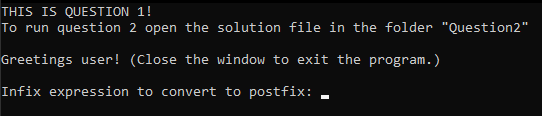
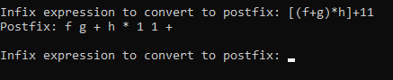
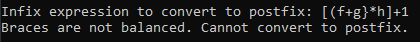
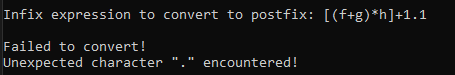

# Assignment 3 - Question 1

### Running the code.
To build and run the code you will need Visual Studio 2022 with the Desktop development with C++ workload installed. Once installed you can open the solution file for the question (Question1.sln) and use the F5 key to run the opened question/project.

## Overview
This program is a Expression Manager that makes uses stacks to check the balance of braces and convert infix expressions to postfix.

## Running the code

Upon starting the program you will be asked to enter an infix expression.   

Upon entering a expression its braces will be checked for balance and if it passes the expression will then be converted into postfix. After which the user will be continuously prompted for expressions to convert until the program is closed.   

If the braces of an input are imbalanced the expression will not be converted and the user will be notified.  

If an unsupported character is entered the user will be notified and the conversion will not take place.   

