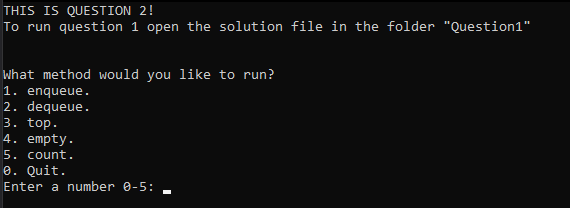
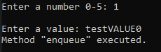
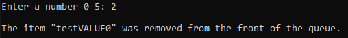
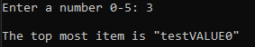
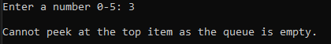
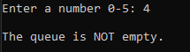
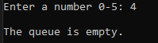
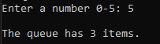
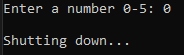

# Assignment 3 - Question 2

### Running the code.
To build and run the code you will need Visual Studio 2022 with the Desktop development with C++ workload installed. Once installed you can open the solution file for the question (Question1.sln) and use the F5 key to run the opened question/project.

## Overview
This program is a simple driver program for the functions of a custom single linked list template class.

## Usage examples of functions

### Command list
Upon starting the program, and after running a command, all the commands are listed and the user is asked to enter the number of the command they wish to run.  
   
(*For the sake of brevity the command list will be omitted from the following screenshots.*)

### 1. enqueue
This command inserts a new element at the rear of the queue.   

### 2. dequeue
This command inserts removes the front element of the queue and returns it.   

### 3. top
This command returns the front element present in the queue without removing it.   

### 4. empty
This command checks wether the queue is empty.    

### 5. count
This command returns the count of items in the queue.   

### 0.  Quit
This command causes the program to exit.   

